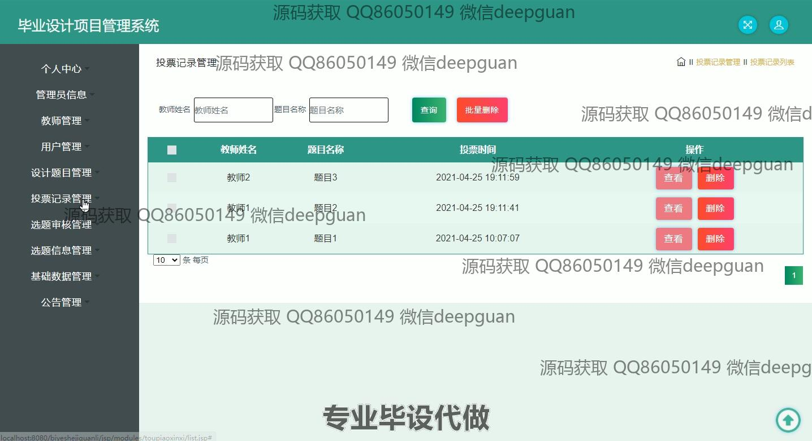

<h1 align="center">毕业设计项目管理系统</h1>

## 简介
毕业设计项目管理系统：角色分为管理员、教师、学生；提供用户管理、设计题目管理、投票记录、选题信息审核和公告发布等功能，实现高效的毕业设计过程管理与协作。    --计算机毕业设计源码；毕设源码；java毕业设计源码

## 联系方式

<h3 align="center">获取完整代码与数据库文件 + 微信：deepguan QQ: 86050149 QQ群: 783742310</h3>

<h3 align="center">可帮忙远程部署 包运行成功！提供远程部署、修改代码、设计文档指导、代码讲解等服务！</h3>

## 功能介绍（完整见运行截图）
管理员：管理员功能包括管理用户信息、教师信息和设计题目信息。他们可以添加、修改、查看和删除用户账户，并审核毕业设计题目。管理员还可以管理项目的投票记录，并查看和发布系统公告。导航菜单中提供个性化设置，确保不同角色用户的功能权限符合管理需求。

教师：教师功能主要围绕管理和审核毕业设计项目。他们可以提交自己的设计题目，查看投票记录和项目投票结果。教师还负责上传和管理项目相关文件，如开题报告和中期报告。此外，他们可以查看学生选题信息，以及在项目发布后的管理和审核阶段给予反馈和审核意见。

学生：学生的主要功能是选择和管理毕业设计项目。他们可以浏览可挑选的设计题目，查看项目详情，并参与项目投票。学生需上传相关项目文件，并在项目期间接受教师的指导和审核。通过个人中心，学生可以看到自己的选题状态、提交记录和接收到的审核意见。

系统用户：所有系统用户，包括管理员、教师和学生，都可以通过系统进行基本的用户信息管理。功能还包括查看项目进度、分配任务，以及接收系统通知和公告。用户可以根据各自的权限对看到的内容进行查看、编辑和管理，使整个毕业设计项目管理过程透明且高效。

## 运行截图

本代码来源于网络,仅供学习参考使用!

